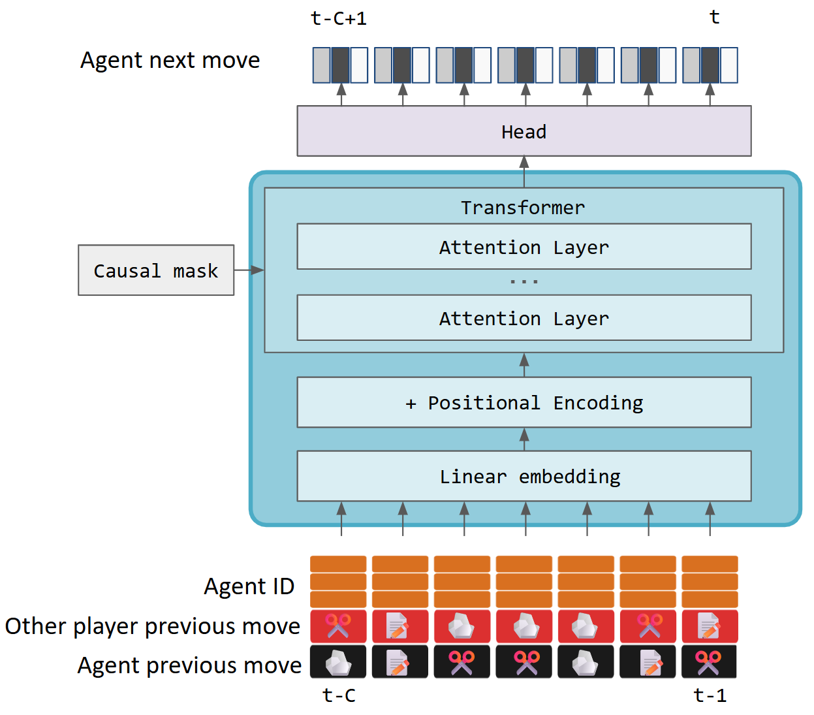

# 🪨📄✂️ Rock-Paper-Scissors Transformer

This repository is a tutorial on training a small transformer to model human behavior: moves in the game rock-paper-scissors. 



## Files

| Path | What it is |
| --- | --- |
| `roshambo.ipynb` | Main student notebook. This is the notebook to work through during the tutorial. It has several exercises interspersed.|
| `roshambo_soln.ipynb` | Completed solution notebook. |
| `roshambo.py` | Jupytext paired Python export of `roshambo.ipynb` |
| `roshambo_soln.py` | Jupytext paired Python export of `roshambo_soln.ipynb` |
| `environment.yml` | Conda environment requirements |

## Setup

To run locally, your Python environment should include
- Python 3.10 or newer
- Jupyter Lab or Jupyter Notebook
- PyTorch
- NumPy
- pandas
- matplotlib
- tqdm
- ipywidgets
- Jupytext

You can create this environment from the provided yml file:
```
conda env create -f environment.yml
conda activate roshambo-transformer
```
Note: `environment.yml` installs PyTorch using the default pip package. This is fine for CPU use and many local setups, but it does not explicitly select a CUDA build. If you have an NVIDIA GPU and want CUDA acceleration, install PyTorch using the command recommended by the official PyTorch selector for your OS and CUDA version: https://pytorch.org/get-started/locally/.

To run using Google Colab:
- Open Google Colab at https://colab.research.google.com/
- In the "Open" dialog, select the "Github" panel and type https://github.com/kristinbranson/roshambo_transformer in the search bar
- Select and open the notebook
- If available, use a GPU to make training faster

## What The Tutorial Covers

The notebook is organized around a gradual build-up:

- Load and normalize rock, paper, scissors game data.
- Explore the dataset.
- Build a supervised sequence dataset where each example is a context window of prior rounds.
- Train simple prediction models and evaluate them against chance.
- Introduce attention with small tensor examples.
- Build intuition for queries, keys, values, attention weights, and causal masking.
- Train a causal transformer over rounds of play.

The transformer in this tutorial treats each round as one token. Unlike a language model where the tokens are words or subwords, each token here is a compact representation of a game state: both players' previous moves, outcomes/totals if enabled, the chosen agent identity, and a learned position embedding.

## Data

The tutorial uses public rock, paper, scissors game data from Erik Brockbank's repositories and papers. Each raw data row is one player in one round, so a two-player game contributes two rows per round.

| Raw data URL | Paper | What is in it |
| --- | --- | --- |
| [`rps_v1_data.csv`](https://raw.githubusercontent.com/erik-brockbank/rps-games-analysis/main/data/rps_v1_data.csv) | Brockbank & Vul (2021), "Formalizing Opponent Modeling with the Rock, Paper, Scissors Game" | Human-vs-human dyads: 62 games and 36,030 player-round rows. Columns include game/round/player IDs, move, response time, outcome, points for the round, and cumulative total. |
| [`rps_v2_data.csv.zip`](https://raw.githubusercontent.com/erik-brockbank/rps/master/analysis/rps_v2_data.csv.zip) | Brockbank & Vul (2024), "Repeated rock, paper, scissors play reveals limits in adaptive sequential behavior" | Human-vs-stable-bot games: 269 games and 139,352 player-round rows. Adds bot metadata such as `is_bot`, `bot_strategy`, and `bot_move_probabilities`; strategies include previous-move, opponent-previous-move, win/loss, and outcome-transition bots. |
| [`rps_v3_data.csv`](https://raw.githubusercontent.com/erik-brockbank/rps/master/analysis/rps_v3_data.csv) | Brockbank & Vul (2024), "Repeated rock, paper, scissors play reveals limits in adaptive sequential behavior" | Human-vs-adaptive-bot games: 227 games and 121,758 player-round rows. Adds bot metadata such as `is_bot`, `bot_strategy`, and `bot_round_memory`; strategies include opponent-transition, opponent-outcome-transition, previous-two-moves, bot-previous-move, and related adaptive bots. |

These raw data files are not part of this repository. The notebooks download them from the URLs above and cache them locally in `rps_brockbank_data/` so repeated runs do not need to download the data again.

## Sources

### Data 

- Brockbank & Vul (2021), "Formalizing Opponent Modeling with the Rock, Paper, Scissors Game": [\[link\]](https://www.mdpi.com/2073-4336/12/3/70). 
  This paper uses repeated human-vs-human RPS to formalize opponent modeling: how people reason about a stable adversary, generate sequential dependencies, and try to outwit each other over time.
- Brockbank & Vul (2024), "Repeated rock, paper, scissors play reveals limits in adaptive sequential behavior": [\[link\]](https://doi.org/10.1016/j.cogpsych.2024.101654). This paper studies repeated RPS against algorithmic opponents of varying complexity, showing that people can exploit simple transition rules but struggle with richer sequential dependencies.

### Transformer background

- Vaswani et al. (2017), "Attention Is All You Need": [\[link\]](https://arxiv.org/abs/1706.03762). Original transformer paper.
- Alammar (2018), "The Illustrated Transformer": [\[link\]](https://jalammar.github.io/illustrated-transformer/). A visual walkthrough of transformer components, especially useful for building intuition about embeddings, attention, and encoder-decoder structure.
- Karpathy (2022), "Neural Networks: Zero to Hero": [\[link\]](https://karpathy.ai/zero-to-hero.html).  A practical video course on neural networks and language models; the transformer material is a helpful companion to the implementation style in this tutorial.

## Further reading on Rock-Paper-Scissors strategies:

- Cross et al. (2025), "Understanding Human Limits in Pattern Recognition: A Computational Model of Sequential Reasoning in Rock, Paper, Scissors": [\[link\]](https://arxiv.org/abs/2508.0650). Models human play against Brockbank & Vul's bots with a hypothesis-generating LLM agent, arguing that people detect simple patterns more readily than complex dependencies.
- Wang et al. (2026), "Discovering Differences in Strategic Behavior Between Humans and LLMs": [\[link\]](https://arxiv.org/abs/2602.10324v2). Uses program discovery to find interpretable models of human and LLM behavior in iterated RPS, highlighting structural differences in strategic reasoning.
- Zhou (2019), "The Rock-Paper-Scissors Game": [\[link\]](https://arxiv.org/abs/1903.05991). A tutorial-style review of RPS as a model of cyclic dominance, Nash equilibrium, evolutionary stability, and non-equilibrium dynamics.
- Batzilis et al. (2019), "Behavior in Strategic Settings: Evidence from a Million Rock-Paper-Scissors Games": [\[link\]](https://www.mdpi.com/2073-4336/10/2/18). Analyzes a large Facebook RPS dataset to ask whether human play in a simple strategic setting matches Nash and related behavioral-game-theory predictions.
- Dyson (2019), "Behavioural Isomorphism, Cognitive Economy and Recursive Thought in Non-Transitive Game Strategy": [\[link\]](https://www.mdpi.com/2073-4336/10/3/32). Reviews RPS strategy taxonomies and uses them to discuss cognitive economy, recursive reasoning, and why different strategies can look behaviorally similar.
- Zhang et al. (2021), "Rock-Paper-Scissors Play: Beyond the Win-Stay/Lose-Change Strategy": [\[link\]](https://www.mdpi.com/2073-4336/12/3/52). Uses human and bot experiments to distinguish random play, Nash-like play, and richer sequential strategies beyond a simple win-stay/lose-change heuristic.
- Xu, Zhou, & Wang (2013), "Cycle frequency in standard Rock-Paper-Scissors games: Evidence from experimental economics": [\[link\]](https://arxiv.org/abs/1301.3238). Reports laboratory evidence for persistent cycling in RPS population dynamics and connects the observations to non-equilibrium game dynamics.
- Wang & Xu (2014), "Incentive and stability in the Rock-Paper-Scissors game: an experimental investigation": [\[link\]](https://arxiv.org/abs/1407.1170). Varies the payoff for winning in generalized RPS and shows that incentives change conditional responses, best-response behavior, and win-stay/lose-shift patterns.

## Credits

Developed by Kristin Branson <kristinbranson@gmail.com> 2026-06-15